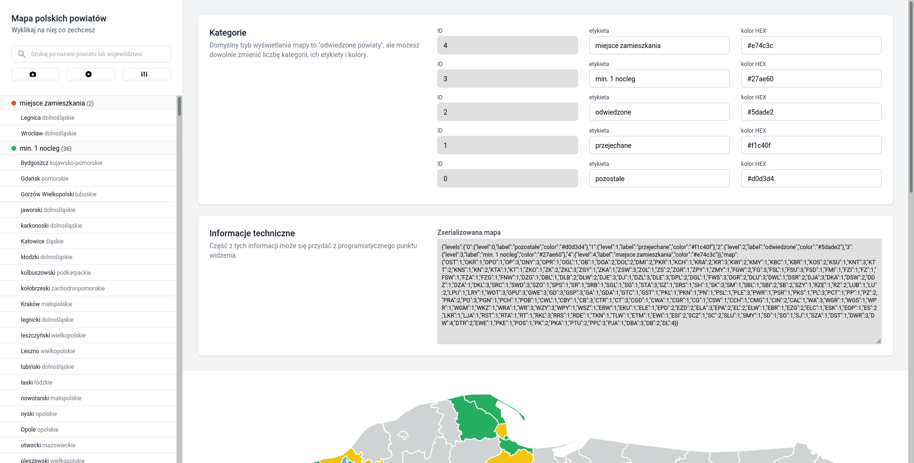

# krzysztofrewak/powiaty
Prosta aplikacja do wyklikiwania różnych rzeczy na mapie polskich powiatów. Dostępna jest pod adresem [https://krzysztofrewak.github.io/powiaty](https://krzysztofrewak.github.io/powiaty)

## Aplikacja
Obecnie aplikacja pozwala na:
* modyfikowanie bazowych kategorii,
* przeszukiwanie listy powiatów,
* przypisywanie powiatów do kategorii,
* robienie screenshota mapy,
* cache'owanie wyklikanej mapy, aby odświeżenie strony nie usuwało pracy.

Prawdopodobnie kilka innych funkcjonalności pojawi się w przyszłości. Zapraszam do zgłaszania pomysłów i znalezionych błędów w zakładce Issues.

### Wygenerowana mapa

## Licencje
Bazowa mapa Polski z podziałem na powiaty została pożyczona z Wikimedia Commons: [https://commons.wikimedia.org/wiki/File:POLSKA_powiaty.svg](https://commons.wikimedia.org/wiki/File:POLSKA_powiaty.svg) 